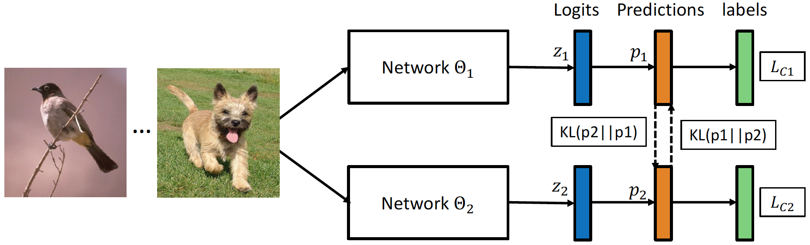

# Deep-Mutual-Learning

TensorFlow implementation of **[Deep Mutual Learning](https://drive.google.com/file/d/1Deg9xXqPKAlxRgmWbggavftTvJPqJeyp/view)** accepted by CVPR 2018. 


## Introduction
Deep mutual learning provides a simple but effective way to improve the generalisation ability of a network by training collaboratively with a cohort of other networks.



## Requirements

1. TensorFlow 1.3.1
2. CUDA 8.0 and cuDNN 6.0
3. Matlab

## Usage

### Data Preparation
1. Please download the [Market-1501 Dataset](http://www.liangzheng.com.cn/Project/project_reid.html)

2. Convert the image data into TFRecords
```
sh scripts/format_and_convert_market.sh
```

### Training
1. Train MobileNets with DML
```
sh scripts/train_dml_mobilenet_on_market.sh
```

2. Train MobileNet independently
```
sh scripts/train_ind_mobilenet_on_market.sh
```

### Testing
1. Extract features of the test image
```
sh scripts/evaludate_dml_mobilenet_on_market.sh
```

2. Evaluate the performance with matlab [code](https://github.com/zhunzhong07/person-re-ranking/tree/master/evaluation)


## Citation
If you find DML useful in your research, please kindly cite our paper:

```
@inproceedings{ying2018DML,
    author = {Ying Zhang and Tao Xiang and Timothy M. Hospedales and Huchuan Lu},
    title = {Deep Mutual Learning},
    booktitle = {CVPR},
    year = {2018}}
```